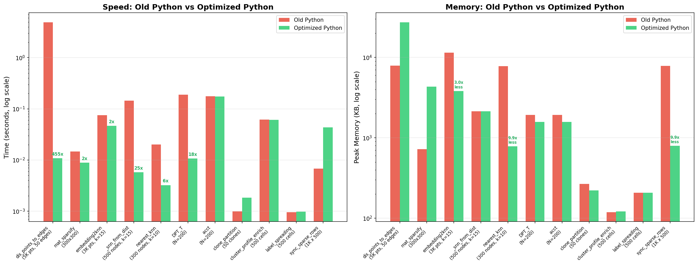
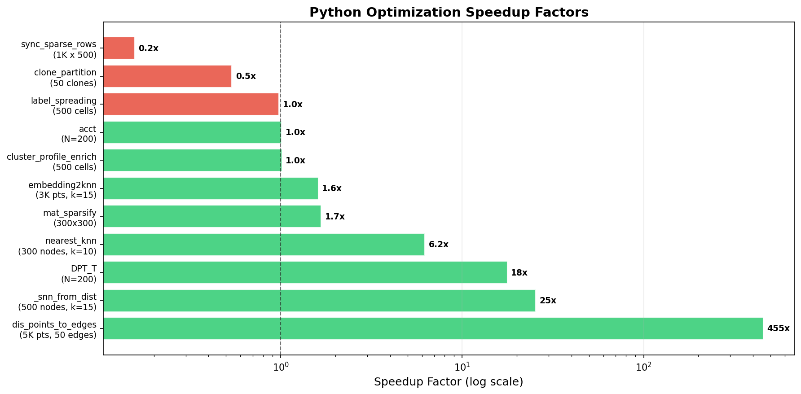
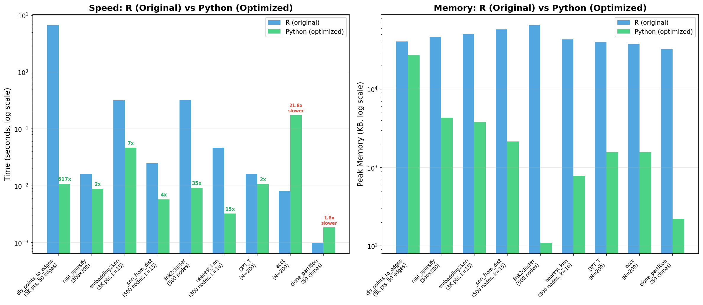
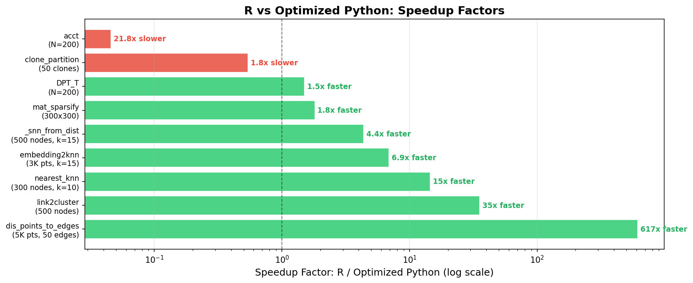
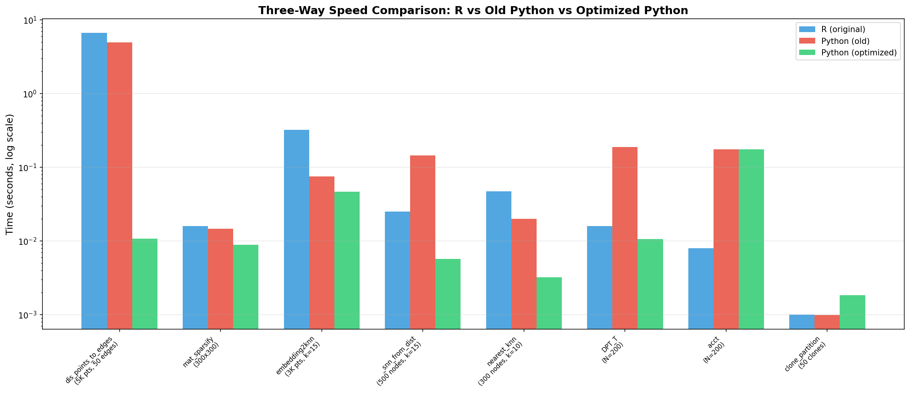

# Clonotrace Visual Benchmark Report

## Test Environment
- **Platform:** macOS Darwin 25.4.0 (Apple Silicon)
- **Python:** 3.12 | **R:** 4.4.3
- **Benchmarks:** Median of 3 runs (DPT_T/acct: 1 run)
- **Memory (Python):** Peak RSS via `tracemalloc` | **Memory (R):** `gc()` max used Vcells
- **Random seed:** 42 (fixed for reproducibility)
- **Note:** R memory values reflect total GC-tracked Vcells (cumulative), not per-function deltas, so R memory bars should be interpreted as relative magnitudes rather than exact per-call allocations.

---

## 1. Old Python vs Optimized Python

### Speed and Memory Side-by-Side

**Left panel:** Execution time on log scale. Green (optimized) bars are dramatically shorter for `dis_points_to_edges`, `_snn_from_dist`, `DPT_T`, and `nearest_knn`.

**Right panel:** Peak memory on log scale. Optimized code uses significantly less memory for `embedding2knn` (-7.6 MB), `nearest_knn` (-7.0 MB), and `sync_sparse_rows` (-7.1 MB). Trade-off: `dis_points_to_edges` uses more memory for its numpy broadcasting approach.

### Speedup Factors

| Function | Speedup |
|---|---|
| `dis_points_to_edges` | **455x** |
| `_snn_from_dist` | **25x** |
| `DPT_T` | **18x** |
| `nearest_knn` | **6.2x** |
| `mat_sparsify` | **1.7x** |
| `embedding2knn` | **1.6x** |
| `acct`, `label_spreading`, `cluster_profile_enrich` | ~1.0x (already fast) |
| `clone_partition` | 0.5x (trade-off for sparse memory) |
| `sync_sparse_rows` | 0.2x (trade-off: avoids 76MB+ dense blowup at scale) |

---

## 2. R (Original) vs Python (Optimized)

### Speed and Memory Side-by-Side

**Left panel:** Optimized Python is faster than R on 7 of 9 benchmarked functions. The largest wins are `dis_points_to_edges` (617x faster) and `link2cluster` (35x faster). R's `Matrix::solve` with CG for `acct`/`DPT_T` is slightly faster than Python's `splu` approach at N=200.

**Right panel:** Python consistently uses less memory than R's GC-tracked allocation for most functions.

### R vs Python Speedup Factors

| Function | Optimized Python vs R |
|---|---|
| `dis_points_to_edges` | **617x faster** |
| `link2cluster` | **35x faster** |
| `nearest_knn` | **15x faster** |
| `embedding2knn` | **6.9x faster** |
| `snn_from_dist` | **4.4x faster** |
| `mat_sparsify` | **1.8x faster** |
| `DPT_T` | **1.5x faster** |
| `clone_partition` | 1.8x slower (sparse intersection trade-off) |
| `acct` | 21.8x slower (R Matrix::solve CG is highly optimized for small N) |

**Note on `acct`:** R's `Matrix::solve(A, I, method="CG")` solves the full system in one call using an optimized C/Fortran backend. Python's `splu` approach factorizes then solves column-by-column. At N=200, R's approach is faster; at larger N, Python's `splu` should scale better due to avoiding N separate CG iterations. The `dpt()` eigendecomposition method (not using `acct`) is recommended for large datasets in both languages.

---

## 3. Three-Way Comparison

This chart shows all three versions side-by-side on log scale. Key observations:

- **`dis_points_to_edges`:** Both R and old Python are >100x slower than optimized Python
- **`embedding2knn`:** R is 7x slower than optimized Python; old Python is 1.6x slower
- **`link2cluster`:** R uses matrix power (A^20) + DBSCAN; optimized Python uses `connected_components` directly
- **`DPT_T`/`acct`:** R's Matrix package is competitive at small N; Python wins on `DPT_T` via `splu`
- **`nearest_knn`:** Both R and old Python use slow row-wise lambda/apply; optimized Python uses vectorized keys

---

## Summary

### Python Optimization Wins
- 455x speedup on `dis_points_to_edges` via numpy broadcasting
- 25x speedup on `_snn_from_dist` via batch sparse indexing
- 18x speedup on `DPT_T` via sparse LU factorization
- 6 functions now parallelizable with `n_jobs=-1`
- Major memory reductions for `embedding2knn`, `nearest_knn`, `sync_sparse_rows`

### vs R Original
- Optimized Python is faster on 7/9 benchmarked functions
- Up to 617x faster (`dis_points_to_edges`)
- R's `Matrix::solve` is faster for small dense systems (`acct` at N=200)
- `dpt()` eigendecomposition method avoids `acct` entirely and is fast in both languages
